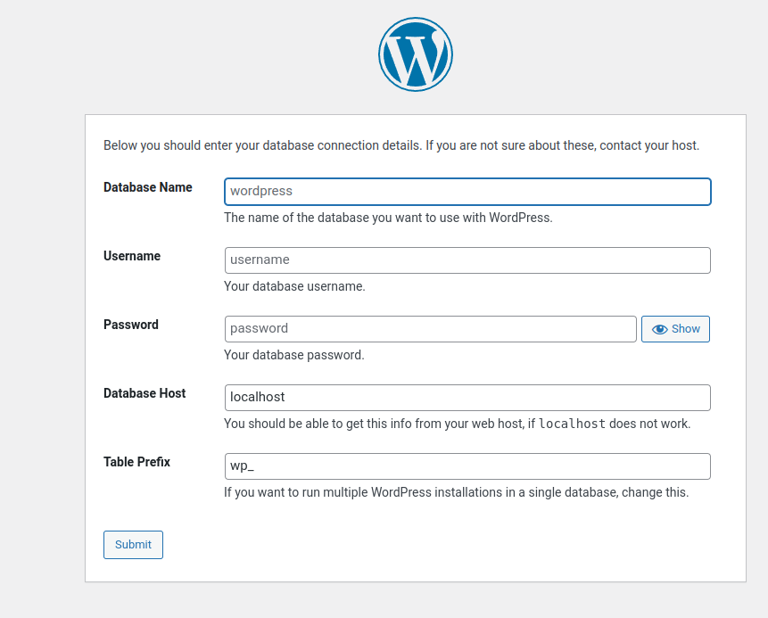

# Study Docker: Linking two dockers together, Mysql and Wordpress

1. Download and run Mysql docker from internet

```
docker run --name mysql2 -v $(pwd)/database:/var/lib/mysql -p 3306:3306  -e MYSQL_ROOT_PASSWORD=peerajak -d mysql:5.7
```

Test Mysql docker

```
mysql --host=127.0.0.1 --port=3306 -u root -p
```

Inside Mysql prompt

```
show databases;
use mysql;
show tables;
select * from user;
```
If you see the data from user table, then mysql works fine.

2. Download and run wordpress docker from internet

```
docker run --name mywordpress --link mysql2:mysql -p 8080:80 -d wordpress
```

The -p The host port is 8080, and the docker port is 80.
The -d is the detach mode.

3. Check the two running dockers

```
docker ps -a
```

You should see something like

```
CONTAINER ID   IMAGE       COMMAND                  CREATED          STATUS          PORTS                               NAMES
72678be82b2b   wordpress   "docker-entrypoint.s…"   10 minutes ago   Up 10 minutes   0.0.0.0:8080->80/tcp                mywordpress
7b6579e023eb   mysql:5.7   "docker-entrypoint.s…"   27 minutes ago   Up 27 minutes   0.0.0.0:3306->3306/tcp, 33060/tcp   mysql2
```

Try Wordpress with
 


You should see



